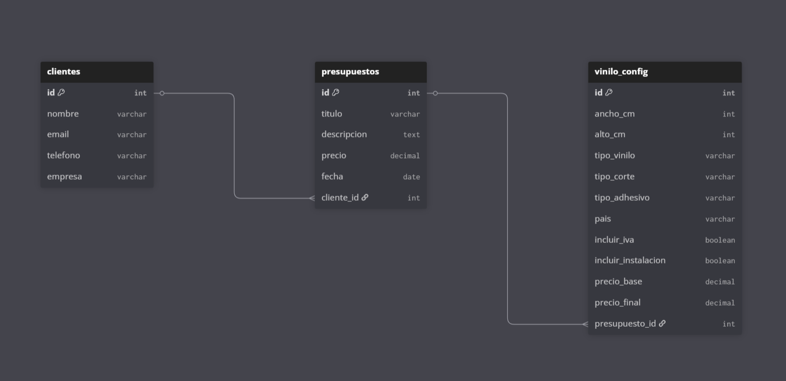

# Memoria técnica del proyecto

Este documento recoge la memoria técnica del backend del proyecto, una API REST para la gestión de clientes y presupuestos de vinilos personalizados. La aplicación está desarrollada con Spring Boot, utiliza JPA para el acceso a datos y una base de datos H2 en memoria para el entorno de desarrollo.

## Modelo de datos

El modelo se ha implementado mediante entidades JPA anotadas en el código Java, de modo que el esquema de base de datos se genera y actualiza automáticamente a partir de estas clases, sin necesidad de ejecutar scripts SQL manuales.

El modelo de datos del backend se organiza en tres entidades principales:

- Cliente
- Presupuesto
- ViniloConfig (configuración de vinilo)

### Tablas y campos

- Tabla `clientes`:
  - `id` (PK, Long)
  - `nombre`
  - `email`
  - `telefono`
  - `empresa`

- Tabla `presupuestos`:
  - `id` (PK, Long)
  - `titulo`
  - `descripcion`
  - `precio`
  - `fecha`
  - `cliente_id` (FK → `clientes.id`)

- Tabla `vinilo_config`:
  - `id` (PK, Long)
  - `ancho_cm`
  - `alto_cm`
  - `tipo_vinilo`
  - `tipo_corte`
  - `tipo_adhesivo`
  - `pais`
  - `incluir_iva`
  - `incluir_instalacion`
  - `precio_base`
  - `precio_final`
  - `presupuesto_id` (FK → `presupuestos.id`)

### Relaciones y diagrama ER

Las relaciones entre entidades son:

- Un cliente puede tener muchos presupuestos (relación 1:N entre `clientes` y `presupuestos`).
- Un presupuesto puede tener muchas configuraciones de vinilo (relación 1:N entre `presupuestos` y `vinilo_config`).

En el diagrama ER (adjunto en la memoria) se representan:

- Entidad `Cliente` conectada con `Presupuesto` mediante una relación 1:N.
- Entidad `Presupuesto` conectada con `ViniloConfig` mediante una relación 1:N.

_Figura 1. Diagrama entidad–relación del modelo de datos del backend._

### Justificación del diseño

Se ha optado por separar el modelo en tres entidades para cumplir mejor los principios de normalización y reflejar el dominio real:

- `Cliente` se separa de `Presupuesto` porque un mismo cliente puede solicitar varios presupuestos a lo largo del tiempo; de este modo no se duplican datos de contacto.
- `Presupuesto` agrupa la información económica y descriptiva de cada propuesta, y referencia al cliente mediante una clave foránea.
- `ViniloConfig` se modela como entidad independiente porque un mismo presupuesto puede incluir varias configuraciones de vinilo (por tamaño, tipo de material, etc.). Cada configuración tiene muchas propiedades específicas, por lo que resulta más limpio tener una tabla dedicada que meter todas esas columnas en `presupuestos`.

Este diseño facilita consultas como:

- Obtener todos los presupuestos de un cliente.
- Calcular el total de presupuestos de un cliente.
- Contar cuántas configuraciones de vinilo tiene un presupuesto.

## Arquitectura del backend

La aplicación sigue una arquitectura en capas típica de Spring Boot, separando responsabilidades en controladores, servicios y repositorios.

- Capa controlador (`controller`): expone la API REST, recibe las peticiones HTTP y delega la lógica al servicio correspondiente usando clases anotadas con `@RestController`.
- Capa de servicio (`service`): implementa la lógica de negocio (validaciones, cálculos y coordinación entre entidades) en clases anotadas con `@Service`.
- Capa de acceso a datos (`repository`): se encarga de la comunicación con la base de datos mediante interfaces que extienden `JpaRepository`, anotadas con `@Repository`.

Este diseño mejora la mantenibilidad del código, facilita las pruebas unitarias y permite evolucionar el modelo de datos o la lógica de negocio sin afectar directamente a la capa de presentación.
